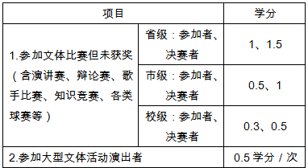

# 创新学分、技能学分、素质学分认定与计算办法

（宁城院政[2010]67号）

为积极鼓励学生在完成专业学习的基础上，全面提高其他各方面的能力和素质，根据《宁波城市职业技术学院高素质高技能应用型人才培养方案指导性意见》，学校决定设立创新学分、技能学分和素质学分，对学生在第二、第三课堂中实施的一系列活动中取得的成果认定一定的学分，并可以作为第一课堂的其他任意选修课学分计入学生毕业总学分和成绩单档案，以资鼓励。

## 一、学分计算的范围：

（一）创新创业学分：主要针对学生在第一课堂以外实施的一系列创新活动中取得的成果的认定,具体如下：

（二）技能学分

1、学生在校期间通过各类技能活动，经一定行业主管部门组织的技能考核获得职业资格鉴定和各类职业技能等级证书者，根据适用范围，难易度等因素给予认定一定学分。

2、体育、音乐、舞蹈、演讲、写作技能学分

（三）素质学分：是指凡是在第一课堂以外实施的一系列对提高学生各方面的素质有帮助的各项活动，都可以按照学生参与的时间来计算的学分，具体如下：

1、思想政治素质：

2、社会实践与志愿者服务：

3、人文素质：

４、活动能力：

## 二、学分的认定与记载：

（一）以上认定学分在学生成绩表中仅记总学分，保留小数点后一位小数。

（二）以上学分可以顶替除专业选修课以外的任意选修课学分。

（三）学分认定申请于每学期13周(毕业生毕业学期第10周)进行，创新学分、技能学分由学生根据相应证明材料向所在学院提出申请，并填写《创新、技能学分认定表》，学院汇总后交教务处审核认定，并记入学生成绩档案。由学校、学院及相关部门组织的集体性活动，由主办单位进行申报，并填写《宁波城市学院素质拓展讲座申报表》和《宁波城市学院学生素质与能力拓展项目申请表》，经团委审核后予以立项，活动组织者在活动结束后填写《宁波城市学院学生素质拓展项目参加情况登记表》交团委审核、认定后，报教务处记入学生成绩档案。

（四）若有本办法以外的其他项目学分认定，将由教务处、团委会同有关部门进行。

三、本办法经第97次校长办公会议审议通过，从2010学年起执行，由教务处、团委负责解释。原《宁波城市职业技术学院创新学分、技能学分、素质学分认定与计算办法》（宁城院政[2008]58号）同时废止。

