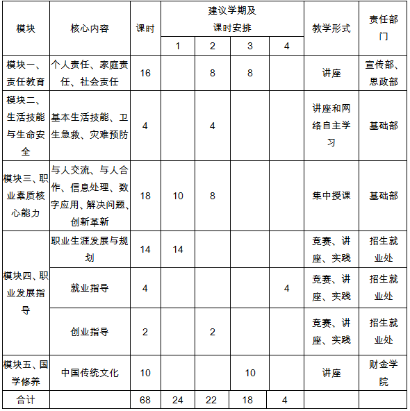
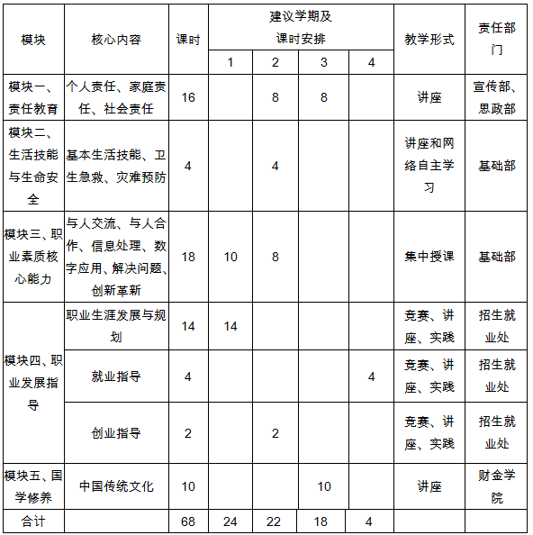

# 宁波城市职业技术学院《职业素质与职业发展》（2013版）课程管理办法（试行）

宁城院政〔2013〕76号

为贯彻落实《宁波城市职业技术学院关于开展职业素质养成教育工作的指导性意见》（宁城院党[2009]27号）和《宁波城市职业技术学院关于修订高职专科人才培养方案的指导性意见》（宁城院党[2013]30号）文件精神，实现构建“素质引领、校企一体、分类培养”的人才培养模式，确保基于“公司制运行的三个课堂联动”的以责任教育为核心的学生职业素质养成教育体系有效实施，并使《职业素质与职业发展》课程的教学质量得到有效保障，特制定本办法。

## 一、课程基本教学要求

根据我校“面向生产、建设、管理、服务第一线，培养一批素质高、知识实、能力强并具有一定创新创业能力的高素质技术技能应用型人才”的培养目标，《职业素质与职业发展》课程基本教学内容包含“责任教育”、“生活技能与生命安全”、“职业素质核心能力”、“职业发展指导”、“国学修养”等5个教学模块；教学形式有讲座、网络自主学习、训练、竞赛和实践等。通过本课程的开设，提高学生的职业综合素质，促进以素质为引领的人才培养模式的有效实施。

## 二、课程教学管理

1、课程标准制定

《职业素质与职业发展》课程由基础部会同相关开课部门、学院在1-4学期开设，课程标准由基础部负责总体设计，相关责任部门、学院根据各自承担的模块内容分别制定各模块的教学标准。

2、课程组织实施

各部门、学院根据《职业素质与职业发展》的课程标准和各模块的教学标准，确定每学期每个教学模块具体教学内容的实施与管理。根据学校开课计划编制要求，每学期第15周前，基础部协调落实相关责任部门、学院下一学期将要开设的课程教学内容及具体分工。

（1）每学期第11周前，相关责任部门、学院完成制定下一学期各教学模块课程实施的具体内容、实施形式、任课教师、时间安排、合班情况等，报基础部汇总、教务处备案批准后予以实施。

（2）每学期第15周前，基础部、教务处根据各责任部门、学院的开课汇总情况，在教务网上做好相关排课工作。

（3）开课学期，各模块的责任部门、学院将排课情况通知至各任课教师，并负责做好教师的日常调停课管理工作；学生所在学院根据课程安排情况负责通知、组织学生参加课程学习，并协助任课教师管理好课堂，同时负责告知、督促、组织管理好学生网络自主学习（4个主题8个学时）的内容。

（4）教务处根据各教学模块的开课计划组织督导对相关责任部门、学院的课程具体实施过程进行抽查与监督。

（5）成绩评定及管理：相关开课部门、学院根据各自所承担的教学任务和课程考核方案，负责记载并评定学生课程成绩，每学期统计一次。每个教学模块课程结束后的该学期（第18周前）成绩需统一输入成绩考核系统或将模块课程成绩汇总后交基础部。相关开课部门、学院要注重过程考核的可行性、科学性与完整性，并能及时将课程成绩反馈给学生。

3、课程教学团队

课程教学团队分校、院（部）二级教学团队，共同负责课程建设与管理。

（1）校级教学团队

由基础部及各开课部门、学院推荐教师共同组成校级教学团队，一般由各教学模块的课程负责人组成，基础部教师任课程教学团队负责人。校级教学团队主要职责为：全面负责、协调处理课程开设过程中教学内容的审核、课程的具体实施、课程成绩的审核、课程标准的编制、课程研讨的组织、课程的具体研究与建设、课程网站建设等工作。

（2）院（部）级教学团队

各教学模块根据课程具体教学内容组建教学团队，一般为该教学模块的主讲教师及课程管理的具体负责人。院（部）级教学团队主要职责为：负责实施本部门、学院教学模块课程开设的具体工作，包括各教学模块课程标准的制定、教学内容的选取、课程的具体组织安排、课程考核方案的制定与过程考核的管理、课程成绩的评定与输入、课程实施效果反馈与改革建议等。

4、课程实施进程

根据课程标准，完成每学期教学任务。具体进程安排详见下表：

表一：课程实施一览表（适用对象：本科及三年制专科）

说明：除了以上5个教学模块，学生还需完成网络自主学习。网络自主学习平台内容包括以上5个模块，学生可以根据自身喜好自行选择主题共完成8个学时。

表二、课程实施一览表（适用对象：3+2专科）

说明：除了以上5个模块，学生还需完成网络自主学习。网络自主学习平台内容包括以上5个模块，学生可以根据自身喜好自行选择主题共完成6个学时。

5、各模块教学班额

各模块（除“职业素质核心能力”模块外）实行大班授课，标准班班人数为120人，“职业素质核心能力”模块标准班人数为40人。

## 三、课程教学工作量

本课程的教学工作量按学校教师教学工作量计算办法执行。

## 四、其他

本办法经第130次校长办公会议审议通过，从2013级学生开始实施，由基础部、教务处负责解释。