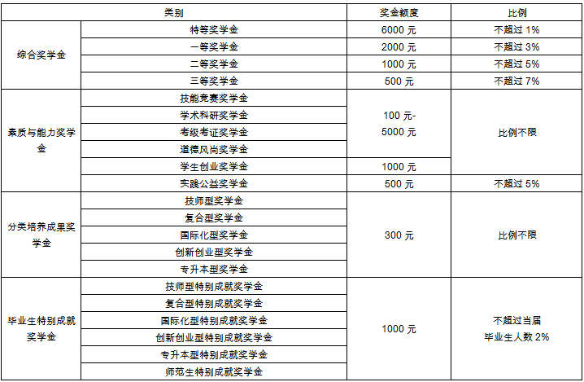
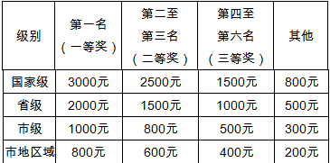
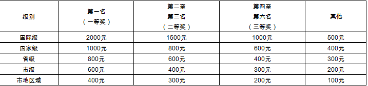
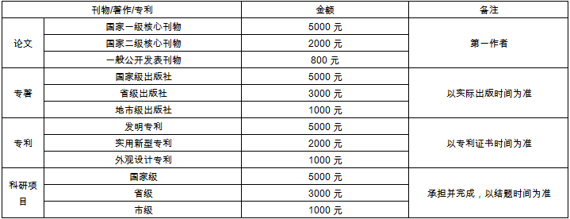
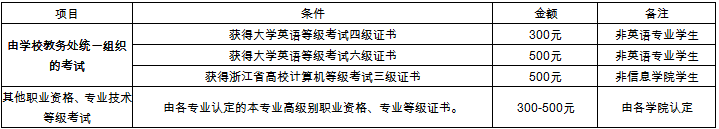

# 宁波城市职业技术学院学生奖学金评定办法

（宁城院政[2015]45号）

第一章	总则

 第一条	为了全面贯彻国家教育方针，落实学校人才培养目标，激励广大学生加强品德修养，刻苦学习、勤于实践，鼓励学生在某一方面或几方面获得专长，成为素质高、知识广、能力强并具有一定创新创业能力的高素质技术技能应用型人才。根据《普通高等学校学生管理规定》，结合学校实际，制定本办法。

第二条	本办法适用于具有宁波城市职业技术学院学籍的全日制普通高等教育学生（毕业生奖学金中的师范生特别成就奖学金适用对象为具有宁波大学职业教育学院学籍的全日制普通高等教育学生）。

第二章	奖学金的类别、等级与比例

第三条	奖学金的类别
奖学金由国家奖学金和学校奖学金两部分组成。国家奖学金包括国家奖学金和国家励志奖学金。学校奖学金包括综合奖学金、素质与能力奖学金、分类培养成果奖学金、毕业生特别成就奖学金。
第四条	评奖等级及比例

一、国家类奖学金

二、学校奖学金

第三章	评选条件

第五条	奖学金基本申请条件

一、申请综合奖学金及素质、实践公益奖学金的基本条件：

1、学生品行评价B等及以上；

2、《学生体质健康标准》达标（免测学生除外），且体育课（含体育俱乐部）成绩合格及以上；

3、评奖学年及评审过程中无违纪处分及未受退学警告；

4、无必修课、模块课不及格。

二、申请分类培养成果奖学金、毕业生特别成就奖学金的基本条件：符合当年毕业条件。

第六条	国家奖学金评选条件

具体详见根据《宁波城市职业技术学院国家奖学金评选实施办法》、《宁波城市职业技术学院国家励志奖学金评选实施办法》。

第七条	学校奖学金评选条件

一、综合奖学金

1、特等奖学金

本学年积点分名次在班级前5％；学生品行评价A等，同时曾获得素质与能力奖学金（修学满一年的须获得一次及以上，修学满两年的须获得二次及以上）或条件相当，经学校认定的。同等条件下以积点分排名前者、素质与能力奖学金评定等级高者、获得次数多者优先。

2、一等奖学金

本学年积点分名次在班级前10％；学生品行评价A等；同等条件下，学年积点分高者优先。

3、二等奖学金

本学年积点分名次在班级前25％；学生品行评价A等；同等条件下，学年积点分高者优先。

4、三等奖学金

本学年积点分名次在班级前40%；学生品行评价B等及以上；同等条件下，学年积点分高者优先。

三、素质与能力奖学金

素质与能力奖学金是奖励在市级及以上各类学科、职业技能竞赛取得优异成绩或在专业学习，科技创新，发明创造，考证考级，道德风尚、实践公益等方面表现特别突出的学生。具体条件如下：

（1）技能竞赛奖学金：代表学校参加各级各类学科和职业技能竞赛、文体比赛并取得成绩的学生。
A类：代表学校参加由各级政府、教育、人力资源和社会保障等行政部门、行业主管部门和相关组织主办的学科和职业技能竞赛。奖励标准如表一。

B类：代表学校参加由各级学会、协会、企业和其它学术团体等非政府机构主办的各类竞赛奖励标准如表二。

表二  各类比赛获奖等级对应奖金一览表（B类）

群众性的文化类、文娱类、体育类比赛参照《宁波城市职业技术学院学科和职业技能竞赛活动管理办法》，根据学校教务处认定类别和等级，酌情认定，参照B类执行。

说明：

①如参赛人数（团体）较少，则视参赛总数及获奖比率酌情考虑奖励等级；如赛事设有特等奖的，参照第一名（一等奖）各等级标准给予奖励，该赛事中其它等级的奖项依次递减一名（等），参照上表相应级别标准给予奖励；

②上表中的“其它”是指在赛事中取得非上述表内所列名次，经学校认定应给予奖励的奖项；

③各类跨市、省、国区域级对照各相应级别的基础上酌情考虑；

④集体项目每增加一人对应等级奖金增加20%，但最高不超过对应等级的3倍。

⑤个人或者团队在同一竞赛项目取得多级名次者，或者既有团队名次又有个人名次者，只按照最高等级奖励。

（2）学术科研奖学金

学生作为第一作者、以宁波城市职业技术学院为单位，在各类学术刊物上公开发表学术文章（核心刊物参照宁波城市职业技术学院当年核心期刊目录），或获得国家专利申请授权等，奖励标准见表三。

表三  科研、学术成果相应奖励一览表

（3）考级考证奖学金

奖励在各级各类职业技能考证考级中取得较高级别证书的学生。

项目	条件	金额	备注
由学校教务处统一组织的考试	获得大学英语等级考试四级证书	300元	非英语专业学生
	获得大学英语等级考试六级证书	500元	非英语专业学生
	获得浙江省高校计算机等级考试三级证书	500元	非信息学院学生
其他职业资格、专业技术等级考试	由各专业认定的本专业高级别职业资格、专业等级证书。	300-500元	由各学院认定

（4）学生创业奖学金

自主创办注册公司，企业的性质和经营项目合法。同时学生本人为企业法人或主要经营者，并已取得工商部门核发的营业执照，网店认定参照省市有关关于大学生从事电子商务（网店）相关文件规定。奖金额度为每项创业成功奖励1000元。

（5）道德风尚奖学金

在精神文明建设中表现突出，具有见义勇为、助人为乐、奉献爱心、服务社会等实际行动，在本校及社会上产生积极影响，为学校赢得良好声誉。由学校奖学金评审委员会决定酌情予以奖励。

（6）实践公益奖学金

积极参加各类社会实践活动，成绩较突出且获得校级及以上荣誉者。热心公益活动，积极参加青年志愿者，本学年被评为校级及以上优秀青年志愿者或星级青年志愿者定级、晋级者。担任校、院、班级干部干部且工作满一学期者，热爱本职工作，积极组织并参加各项活动，热情为同学服务，工作成绩突出。

（7）其它不在上述之列的，由奖学金评审委员会决定参照本奖励标准酌情给予奖励。

四、分类培养成果奖学金

分类培养奖学金主要奖励经过学校分类培养，达到了分类培养目标的应届毕业生，奖金额度为300元/生。具体条件如下：

（1）技师型

以获得行业领域高度认可的高等级证书为标志，一般要求技师及以上职业等级证书或相应职业技术等级证书，以及在省级及以上教育行政部门组织的学科技能比赛中获得省级一等奖及以上奖项的学生。

（2）复合型

学生跨专业大类选修专业学习，并获得相应辅修专业或双专业证书。

（3）国际化型

学生毕业时获得合作双方的毕业证书或当年出国出境深造学习，或者在国外境外就业。

（4）创新创业型

学生在校期间或毕业当年工商注册成立实体公司并有效运行，或在校期间累计完成了横向专业技术服务实体项目经费在5万元以上，或在国家、省级创新创业大赛中获奖，或参加浙江省大学生科技创新活动计划(新苗人才计划)并在毕业前顺利结题为标志。其中创新创业大赛指的是：“挑战杯”大学生课外学术科技作品竞赛；“创青春”大学生创业大赛；“挑战杯—彩虹人生”全国职业学校创新创效创业大赛；浙江省高职高专院校“挑战杯”创新创业竞赛；“挑战杯”网络虚拟运营大赛等比赛；全国、浙江省职业生涯规划大赛“创新创意类”、“创业实践类”。

（5）专升本型

毕业当年升入相关全日制普通本科院校继续深造学习者。

五、毕业生特别成就奖学金
特别成就奖学金主要用于奖励在体现学校人才培养目标在某一方面有突出表现的符合毕业条件的应届优秀毕业生，人数不超过当届毕业生人数的2%，奖金额度为1000元/生，具体条件如下：

（1）技师型特别成就奖学金

 符合技师型培养目标，并在该类学生中表现突出，职业等级证书等级高、数量多或者学科技能比赛级别奖项高者优先。

（2）复合型特别成就奖学金

符合复合型培养目标，并在该类学生中表现突出，学习成绩积点分高者优先。

（3）国际化型特别成就奖学金

符合国际化性培养目标，并在该类学生中表现突出，学习成绩积点分高者优先或者出国出境录取学校综合排名好或者国外境外就业情况好者优先。

（4）创新创业型特别成就奖学金

符合创新创业培养目标，并在该类学生中表现突出，工商注册成立实体公司规模较大，运行情况好者；或横向专业技术服务实体项目经费高者；或获国家、省级创新创业大赛、职业生涯规划大赛“创新创意类”、“创业实践类”中获奖等级高者；或浙江省大学生科技创新活动计划(新苗人才计划)并在毕业前顺利结题，效果好者优先。

（5）专升本型特别成就奖学金

符合专升本型培养目标，专升本考试成绩当届专升本升学学生中名列前茅，升入的本科院校综合排名前。

（6）师范生特别成就奖学金

符合宁波大学职业技术教育学院职教师资专业毕业条件的应届毕业生，有志于从事职业教育工作，被各级各类学校招录者，专业相关度高者优先。

第八条	各二级学院提取奖学金经费用于 “考级考证奖学金”等学院认定部分，具体实施细则和个性化方案需由学院学生工作领导小组通过，并需每学年初在学生处备案。学生处对学院奖学金使用情况进行审核。

第四章	评选的机构、原则和程序

第九条	评选机构

奖学金评定工作由学校奖学金评审委员会组织进行，学生处负责实施。综合奖学金与实践公益奖学金、考证考级奖学金（学院认定部分）由学院负责具体评审。素质与能力奖学金、分类培养成果奖学金、毕业生成就奖学金由学生处负责具体评审。国家奖学金、国家励志奖学金根据国家相关规定具体实施。

第十条	评选原则

在评奖中必须坚持“公开、公平、公正”、“宁缺毋滥的”原则，做到评选条件公开、评奖名额公开、评奖程序公开和评奖结果公开，实行学院、学校、班级三级公示制度。

第十一条  评奖程序

综合奖学金申请每学年评定一次，一般在10月份评定上一学年的奖学金。分类培养奖学金、毕业生特别成就奖学金申请一般在5-6月份进行。素质与能力奖学金（除实践公益奖学金与综合奖学金申请时间一致）一般可随时申请。国家奖学金和国家励志奖学金的评审时间以上级部门的通知为准。

一、综合奖学金与实践公益奖学金由学院负责评审，班主任主持班级的奖学金评选工作。具体评选程序如下：

（1）学生申请。学生根据本人表现，对照评奖条件，向所在班级提出申请,并填写奖学金申请表。班主任召集班级奖学金评审小组（可邀请部分任课教师），对提出获奖申请的学生进行初评，确定获各类奖学金的初评名单，经班级公示后，报学院审核。

（2）学院评审。学院对班级上报的奖学金初评名单进行统一评审，经评定的获奖学生名单在学院内公示；在充分征求师生意见后，学院将各类奖学金获奖名单报送学生处。

（3）学校审核。学生处对各类奖学金名单进行统一核定，审核后在校内公示，不符合获奖条件的取消名额，不进行补报，公示后名单报学校奖学金评审委员会，确定最终获奖名单。
二、素质与能力奖学金根据获奖情况，由学生本人向学院提出申请，学院审核后报学生处审定，学生申报此项奖学金时，需附有相关证明材料。素质与能力奖学金可在获奖后6个月内随时申报、评审、奖励。

三、国家奖学金、国家励志奖学金评奖程序根据《宁波城市职业技术学院国家奖学金评选实施办法》、《宁波城市职业技术学院国家励志奖学金评选实施办法》实施。

第十二条 学生处负责奖学金评定中的过程控制和指导监督，并在评奖期间设立咨询、投诉信箱和电话，受理学生的咨询和投诉。

第五章	表彰与奖励

第十三条 学校对各类奖学金获得者名单进行发文公布，予以表彰，并颁发奖学金、荣誉证书。学生获奖材料存入本人档案。

第十四条 国家类奖学金的表彰与奖励根据教育部组织实施。

第十五条 综合奖学金原则上不可兼得。国家类奖学金与综合奖学金荣誉可兼得、奖金不兼得，奖金发放遵循就高原则。

第六章	附则

第十六条  获奖学生中，凡发现有弄虚作假、欺骗组织等行为者，学校将撤消其荣誉，追缴已发的奖学金，并按有关规定给予相应的违纪处理。

第十七条  本办法经第151次校长办公会议审议通过，自2015年9月10日起正式执行，由学生处负责解释。原《宁波城市职业技术学院学生奖学金评定办法》（宁城院政[2010]70号）同时废止。

